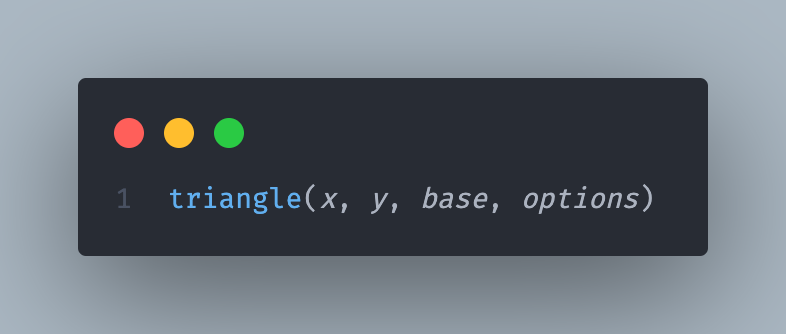
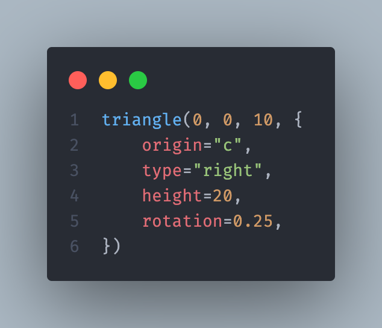
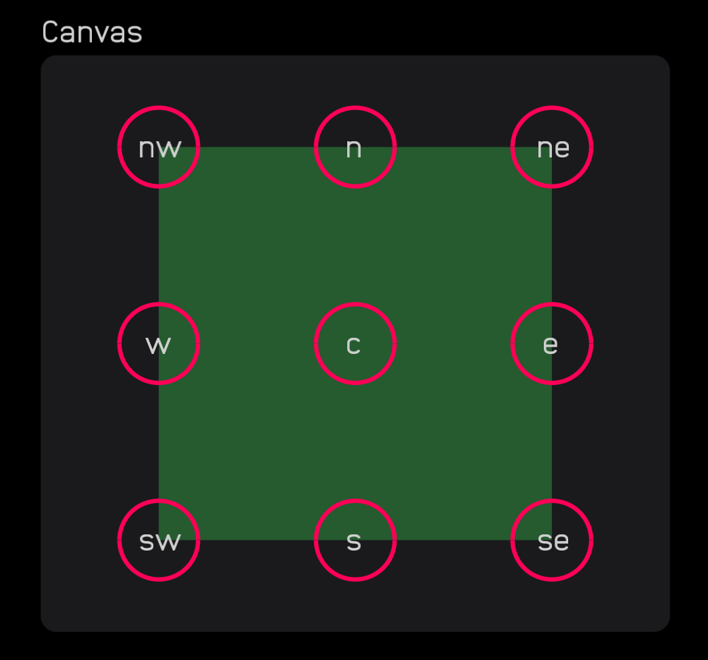
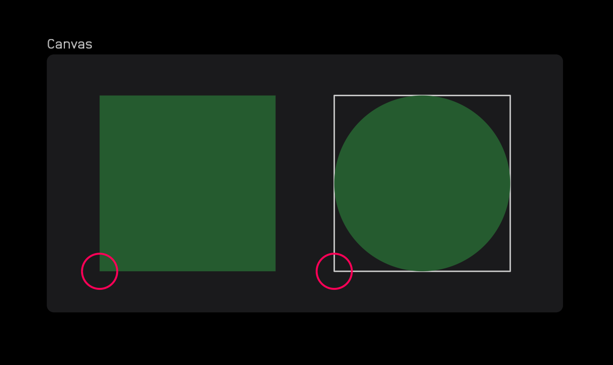
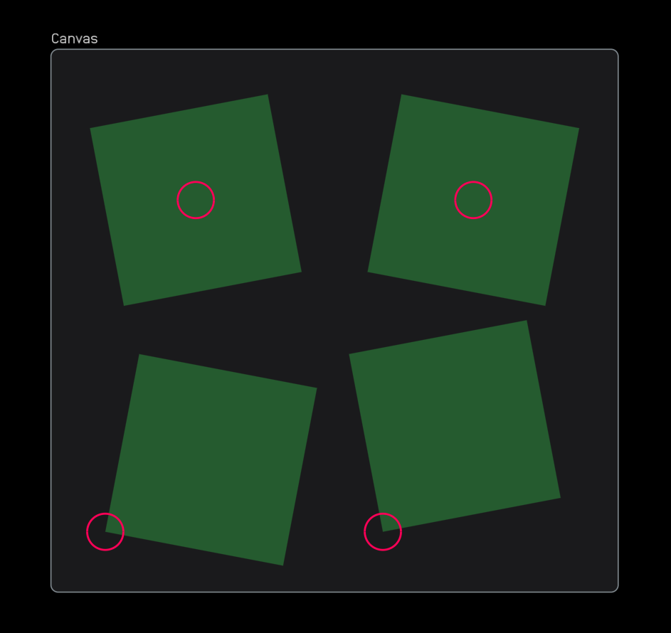

# Audulus-Canvas

The Canvas node in Audulus 4 uses [Lua](https://www.lua.org) to draw text and graphics. It works with an implementation of [vger](https://github.com/audulus/vger).

In the Canvas node, you are given several [built-in](/code/builtins/builtins.lua) functions to draw lines, rectangles, circles, and text. The functions in this library extend these built-in ones to make it easier to draw more complex graphics.

## How to Use

All of the available functions are in the [code](/code) folder.

Each function is in its own `.lua` file. To use a function, copy the code from the file into the Canvas node.

To ensure modularity and work around the limitations of the Canvas node, no functions have any dependencies on other functions. This means that you can copy and paste the code from any function into your Canvas node and it will work.

### Required Arguments

All functions that draw something on the screen take `x` and `y` as their first two arguments. The next argument or two is usually a `width`, `length`, `base` or `diameter`. The last argument, `options`, is a table of keyword arguments.

Other functions will have different required arguments. Always check docstring comments at the top of the file to see what arguments a function takes.

For all functions, every argument except `options` is required. If you don't specify a value for an argument, the function will not work.

### Keyword Arguments

Lua implements keyword arguments using a table. The `options` argument is a table that contains the keyword arguments.

Keyword arguments are optional. You can specify any number of them in any order. 

Each keyword argument has a default value. If you don't specify a value for a keyword argument, the default value will be used. For example, the default paint value for shapes is `color_paint{1, 1, 1, 1}`.

In the example above, a right-angle triangle will be drawn at `0, 0` with a base of `10`, a height of `20`.

Notice that when keyword arguments take a string as a value, you must enclose the string in quotes. This is because Lua uses quotes to distinguish between strings and variables.

Some functions take a lot of arguments. To make it easier to read, you can organize the arguments into multiple lines. In the example above, the `x`, `y` and `base` arguments are on the first line. 

The `options` argument is a table, so it is enclosed in curly braces. Leave the first curly bracket `{` on the first line and put the last curly bracket and closing parenthesis `})` on the last line. The keyword arguments go between the brackets indented by four spaces.

### Origins

Some functions take an `origin` argument. This argument specifies where the shape will be drawn relative to the `x` and `y` arguments.

The default value for `origin` for most shapes is `sw`. For circles, the default value is `center`.

Note that these origins are the same regardless of the shape, as seen above. The `sw` origin for a rectangle is the bottom left corner, while `sw` for the circle is the bottom left corner of an imaginary square that surrounds the circle.

Also note that the `rotation` argument will rotate around the origin. In the example above, the top two are rotating around the `c` origin, while the bottom two are rotating around the `sw` origin.